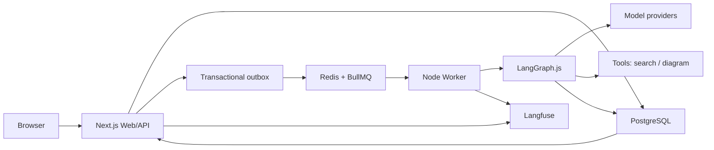
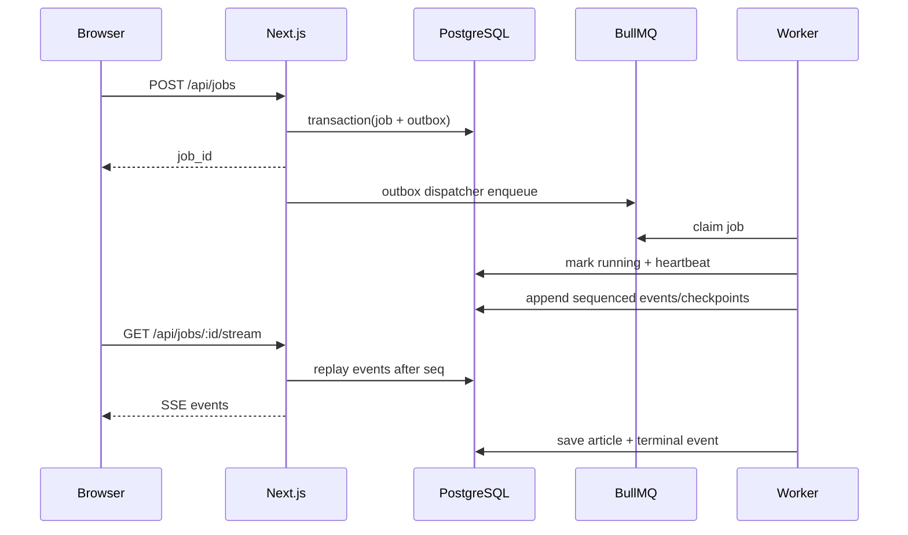

# vibe-writer TypeScript 全栈重构系统设计

> 状态：Accepted baseline。最后更新：2026-08-11。

## 1. 目标与边界

### 目标

- 使用 TypeScript 统一 Web、API、Agent、Worker和eval的主要工程语言；Memory作为未来可选模块，不属于当前产品MVP。
- 保留当前 `plan → write → review → export` 产品行为，并允许后续增加更细的节点和策略。
- 让长任务在进程重启、浏览器刷新和多实例部署下可恢复、可取消、可审计。
- 从第一阶段开始记录 prompt、model、tool、graph 和 dataset 版本，支持回归评测。
- 明确区分execution checkpoint、短期任务context与未来可能的长期memory/RAG，当前只实现前两者的产品路径。
- 用渐进式替换保持每个迭代可验证，避免一次性重写后无法判断质量变化。

### 非目标

- 本轮不进行视觉重设计。
- 不把系统改写成多个自治 Agent 互相协商；当前核心仍是显式状态图。
- 不复制 Youniverse 的 NestJS/CQRS、gateway 和多应用规模。
- 不在迁移早期同时引入多个 LLM 编排框架作为核心依赖。
- 不在没有评测证据时优化 embedding、rerank、prompt 或模型参数。

## 2. 当前事实

当前只有一条TypeScript产品链路。`apps/web`使用Next.js App Router承载页面、`/api/durable/**` Route Handler、SSE和Article UI；`apps/worker`作为独立常驻Node进程承载BullMQ dispatcher/consumer、LangGraph.js、provider调用、heartbeat与恢复。PostgreSQL保存Job、Run、Event、Outbox、Checkpoint和Article事实，Redis/BullMQ只负责投递、重试与并发控制。

一次任务按以下方式执行：

1. Next.js在同一PostgreSQL事务创建Job与Outbox；
2. dispatcher领取Outbox并发布BullMQ job；
3. consumer取得lease/fencing token并执行LangGraph.js；
4. outline interrupt、回复、进度Event与Checkpoint都持久化；
5. terminal transaction原子提交Article、done Event与Job/Run终态；
6. Next.js SSE按`_seq`重放，Article Server Component直接读取PostgreSQL。

FastAPI/Python、Next API rewrite、进程内JobStore、SQLite article与跨运行时shadow runner已在Iteration 0063退役。历史fixture和ADR只保存迁移证据，不形成可启动fallback。回滚使用同一TypeScript artifact版本与PostgreSQL备份。

部署边界为Vercel Next.js Web/API + 外部常驻TypeScript Worker。首个个人MVP使用受Vercel Authentication保护的Preview和固定单用户identity；公开Production仍需要正式session/identity adapter。Memory实验模块保持默认关闭，不构成当前产品能力。

## 3. 目标架构



### 运行时职责

| 运行时 | 负责 | 不负责 |
|---|---|---|
| Next.js | 页面、认证、HTTP API、SSE、文章 CRUD | 跨请求长期运行 Agent |
| Worker | LangGraph、工具调用、写作任务执行、heartbeat | 页面渲染和用户会话 UI |
| PostgreSQL | job、event、article、checkpoint、memory、eval 的业务真相 | 高吞吐实时广播 |
| Redis/BullMQ | 投递、并发、重试、优先级、短期广播 | 唯一任务状态和唯一事件历史 |
| Langfuse | LLM trace、dataset experiment、score 分析 | 产品核心数据真相 |

## 4. 目标仓库结构

```text
apps/
├── web/                    # 最终为 Next.js App Router
└── worker/                 # 长生命周期 Node Worker

packages/
├── contracts/              # Zod API、SSE、tool 和领域事件契约
├── agent-core/             # 领域服务、工具循环、纯 policy 与数据类型
├── workflow-runtime/       # LangGraph.js adapter、interrupt 和 graph assembly
├── model-runtime/          # model profile、provider adapter、usage
├── db/                     # Drizzle schema、repository、migration
├── memory-core/            # 已实现：纯 policy、proposal、dedupe/conflict
├── memory-runtime/         # planned：extractor、retrieval、context assembly
├── evals/                  # suite、case、grader、baseline comparison
└── observability/          # trace、metrics、structured logging ports
```

`agent-core` 只能依赖接口和领域类型，不能导入 LangGraph、Next.js、BullMQ 或具体 trace vendor 类型。`workflow-runtime` 可以依赖 LangGraph，但不能拥有数据库、队列、provider 或 trace vendor；`apps/*` 负责把这些基础设施 adapter 组装起来。

## 5. 写作任务数据流



### Research 与工具边界

Research 不把供应商 SDK response 或中文错误提示直接交给 Writer：

```text
CoveragePlannerService → CoveragePoint[]
ResearchService orchestrator
  → query policy (clock + date bounds)
  → SearchProvider port
  → SearchDocument[] (title/url/date/content/score)
  → deterministic ranking
  → TextModel distillation
  → ready | empty | unavailable | failed
```

自由研究继续由 Writer 自主选择工具，不把 Coverage 的搜索建议变成强制节点。搜索与网页读取分层：Tavily、Brave Search 或 SearXNG 只通过 `SearchProvider` 返回标准来源；模型选中 URL 后可调用 `extract_webpage`，由 `WebPageExtractor` 的本地 Readability adapter 提取正文。任意 URL 在每次请求与重定向前经过公网 DNS/IP 校验，实际连接钉在已验证地址，并受协议/端口、content-type、timeout、响应字节与正文长度约束。提取正文明确标为外部不可信内容，只进入当次工具上下文，不进入 `job_events`、effect journal 或 trace。

Agent core 只认识 `SearchProvider` 和结构化来源。Worker adapter 负责 Tavily/其他供应商的鉴权、timeout、retry、字段校验和 trace。当前以来源 URL 作为稳定引用；内部 source id 要等来源/RAG 数据表落地后分配。Writer search tool 已消费结构化 status：给模型的 compact result 保留 URL/来源序号，执行记录保留 provider/request id 与 source metadata；unavailable/failed 被标为错误且不能当作研究证据。查询策略使用注入 clock 与日期上下界，保证 eval 能以固定 as-of date 重放。

### Writer 与工具循环边界

```text
WriterService
  → versioned chapter prompt + token budget
  → ToolLoopRunner (8 tool rounds / 8 dispatched calls)
    → ToolModel port
    → strict registered tools
      → search (3 calls / chapter) → ResearchService
      → extract_webpage (3 calls / chapter) → WebExtractService
      → generate_diagram
  → ready | inconclusive
```

工具的 Zod input schema 同时用于 runtime validation 和生成 provider JSON Schema。每个 assistant tool call 必须在下一条 user message 收到同 id 的 result；未知工具、非法输入、handler/tool error 和预算耗尽都以安全的 `isError` result 返回。空白文本、非法协议、`max_tokens`、`refusal`、`pause_turn` 或轮次耗尽都不能成为成功正文。

`ToolBudgetUsage` 必须进入未来 graph state/checkpoint，重写时传回 Writer，才能把 3 次 search 和 8 次 dispatch 上限真正约束在整章而不是单次 attempt。超限 attempted call 仍产生 error result，但不执行外部 handler。模型调用的 provider/model/stop reason/usage/request id 作为 metadata-only 记录返回；best-effort observer 也不携带工具正文。完整 transcript 和 execution content 默认不持久化，未来 trace/eval 只在显式采样、去标识化与保留策略下保存原文。

Anthropic adapter 已实现真实 `TextModel`/`ToolModel` wire mapping；Tavily、Brave Search 与 SearXNG adapter 已实现 `SearchProvider`，本地 Readability adapter 已实现 `WebPageExtractor`；graph cancellation signal 与 style 会贯穿 service 到 adapter。Iteration 0017 已在 Worker composition 把外部调用接入 fenced `run_effects`，Iteration 0021 增加同事务 bounded provider trace；但 node/HTTP/queue distributed trace、vendor export和收费 live smoke尚未完成，因此供应商真实可用性和质量仍未证明。

### 人工确认

大纲确认使用 LangGraph `interrupt()` 和持久化 checkpointer。Worker pause transaction 把 framework interrupt id/payload 投影到 `job_interrupts`，同时写 `outline_ready` 和 `awaiting_input`。reply API 只把单个、带 fingerprint 的 `job_commands` 写入 PostgreSQL，并在同事务把 job requeue、追加 resume outbox；它不在 HTTP 进程内调用 graph。

新 run 恢复 checkpoint 后，只有 checkpoint 仍返回同一 interrupt 且存在匹配 command 时才调用 `resumeOutline()`。checkpoint 已前进时只 replay，避免 crash/takeover 后重复应用回复。初次 queue delivery 使用 `write-{jobId}`；resume 使用 `resume-{outboxEventId}`，既保证同一 outbox 重试去重，也避免 BullMQ retained completed job 吞掉第二次投递。

### 取消

取消是持久化状态，不只是一条进程内信号：

1. API 写入 `cancel_requested_at`；
2. Redis Pub/Sub 可以立即通知 Worker；
3. Worker 使用 `AbortSignal` 中止模型/工具调用，并在节点边界复查数据库标志；
4. 丢失 Pub/Sub 时，heartbeat 轮询仍能收敛到 cancelled；
5. terminal transition 使用条件更新，避免 completed/failed/cancelled 相互覆盖。

### Worker claim、lease 与 fencing

队列投递只表示“请尝试执行”，不授予数据库写权限。Worker 必须先在 PostgreSQL 原子 claim；每次成功 claim 同时创建一个 run attempt 和随机 `lease_token`：

```text
duplicate queue delivery
  → conditional DB claim (queued or expired running only)
  → job + run receive worker_id / lease_token / DB-time expiry
  → heartbeat(job_id, run_id, lease_token)
  → execute with AbortSignal
  → fenced settle(job + run)
```

Worker id 只用于诊断，lease token 才是 fencing credential。过期接管会创建新的 token/attempt，并把旧 running run 标记为 `lease_expired`；旧 Worker 即使恢复，也不能 heartbeat 或 settle job/run。running job 的取消请求不直接抢走 token，而是让下一次 heartbeat 返回 `cancel_requested`，Worker abort 后用原 token settle cancelled。claim、heartbeat 与 expiry 都使用数据库 `clock_timestamp()`，避免多主机时钟漂移，也避免事务在 row-lock 等待期间继续使用冻结的 transaction timestamp；event/effect 写入取得 job row lock 后必须用当前数据库时钟重检 lease。

Iteration 0010 已用两个独立 PostgreSQL backend session 验证 duplicate claim 的 row-lock/recheck、event seq/idempotency、effect reservation 和 expired takeover；PGlite 继续承担快速 migration/repository 回归。这仍未验证托管 PostgreSQL、连接池代理、BullMQ stalled/retry、进程 kill 或网络分区。

run progress event 通过 fenced `appendRunEvent()` 写入：事务锁定 job、校验 `job_id + run_id + lease_token` 与 DB-time expiry，再按 job-scoped key 分配连续 seq。同 key/同 payload 跨 attempt 重放原 event，同 key/不同 payload 报 collision。`done/cancelled/error` 被禁止走该 API；Iteration 0013 的 terminal repository 已把它们与 article（完成态）、job/run terminal、seq 和 lease 清理收敛到 fenced transaction。

Iteration 0012 已把 transactional outbox 接到 BullMQ 5.81 adapter：dispatcher 通过 `SKIP LOCKED` 和每次领取生成的 lock token fencing mark/release；Redis payload 只允许版本化 job id 指针。Iteration 0013 又把 processor 接到显式 `completed | awaiting_input | failed` executor result 和 terminal repository。Iteration 0018 已在同一 harness中用真实 PostgreSQL、Redis/BullMQ、PostgresSaver、Anthropic wire adapter和 production `role=all` composition完成一次 job → article/done；该证据仍不包含 Next.js流量、真实 provider、OS signal/network partition或托管部署。

`run_effects` journal 用稳定 effect key 和 request fingerprint 记录 model/tool/search/export 的 reserved/succeeded/failed/uncertain。takeover 或 run 在 reservation 未完成时终结，会把它标为 uncertain；旧 token 不能完成记录。Iteration 0017 已让 graph 生成 node/chapter/attempt scope，ToolModel 增加 request ordinal，search 增加 tool/round/call，并在 production composition 中用当前 lease reserve/finish 真实 Anthropic/Tavily 边界。只有首次 `reserved` 才允许调用；其他 replay/uncertain 状态全部 fail closed。

成功记录只包含 provider/model/request id/usage/latency/stop reason/document count 等 bounded metadata；prompt、messages、响应正文、query、URL 和 snippet 不进入 journal。`previously_succeeded` 仍不保证完整正文/tool output 可恢复，adapter 需要 checkpoint、provider read API 或专用 resolver；外部已成功但本地 finish 失败的窗口仍是 uncertain，因此不能宣称 exactly-once。

PostgresSaver checkpoint 与 job lease 是两种不同责任：前者恢复 graph state，后者决定当前 run 的业务写入授权。Iteration 0011 已实现 per-run 物理 checkpoint `thread_id` 与空 root namespace；新 attempt 只从业务表中 fenced 的稳定 root checkpoint fork 到新物理 thread，并复制 pending writes。官方 saver 先写 envelope，业务 repository 再在有效 lease 下推进 pointer；若中途丢 lease，orphan 只留在旧物理 thread，不能改变新 attempt 的恢复点。

`DurableWorkflowExecutor` 在 fresh attempt 创建带不可变 run config 的初始 state；存在 stable checkpoint 时只 replay，不重建业务进度。graph 的 completed 只产生 `ExportIntent`，随后由 runner 调用 terminal transaction。checkpoint 和业务终态仍是两个提交点：若在二者之间崩溃，takeover run fork/replay terminal checkpoint，不重复 Planner/Writer，再幂等提交 article/done。outline interrupt 则原子投影为 `awaiting_input + outline_ready` 并释放 lease，不得误写 completed。

### SSE

- `job_events(job_id, seq)` 唯一有序；唯一约束防止重复序号。
- DB event history 是重放真相，Redis 只减少轮询延迟。
- 客户端携带最后序号重连；同一事件重复到达必须幂等。
- `done`、`cancelled`、`error` 是终止事件，收到后主动关闭连接。
- staging Route Handler 以 `after_seq`/`Last-Event-ID` 做 catch-up，并用 PostgreSQL 有界轮询和 keepalive 维持 fetch-SSE；未配置 Redis notification 只影响延迟，不影响重放正确性。
- durable routes 只有 `DURABLE_API_ENABLED=true` 才访问数据库；API liveness独立，readiness还要求PostgreSQL可达且durable业务表完整。浏览器默认`API_BASE=/api/durable`，Article Server Component始终读取同一PostgreSQL数据源，不存在独立切流flag或HTTP fallback。

### 部署健康与退流

- Next `/api/durable/health/live`只证明HTTP进程存活；`/ready`证明durable flag、数据库连接和业务schema可用，不聚合Worker状态。
- Worker仅在显式配置health port时监听；核心 durable/trace relations、PostgresSaver、BullMQ publisher/consumer完成后才ready。漏跑 migration 必须在接流前失败。
- shutdown先把Worker置为draining，再停止dispatcher/consumer intake；readiness不能在drain期间继续返回200。
- API与每个Worker角色必须分别被探测，随后运行canary job；健康探针不是端到端质量或积压指标。
- 公开切流步骤、No-Go与回滚数据对账见[Durable切流Runbook](./runbooks/durable-cutover.md)。

### Article current revision 与历史快照

- terminal transaction 创建 revision `0` 的 current article，并固定 source run、graph/prompt/code provenance；后续用户编辑不改写 provenance。
- durable list/detail 以 PostgreSQL 为唯一读源，并在现有 wire shape 上增加 revision；版本记录暴露 source revision。
- PATCH/restore 必须提供 `expected_revision`。repository 锁定 article row 后重检，只有匹配者能保存旧 current snapshot、更新正文并把 revision 加一。
- restore 保存的是恢复动作发生前的 current draft，因此恢复本身可撤销；历史记录不可修改，且 `(article_id, source_revision)` 唯一。
- revision conflict 返回 `409 + current_revision`，不产生快照。它是客户端刷新、展示冲突或未来做 diff/merge 的明确协议，不允许退回 last-write-wins。
- current article 的数据库正文是业务真相；terminal 时生成的 `output/*.md` 是一次性导出物，编辑和 restore 不隐式覆盖它。

## 6. Identity、Workspace 与安全边界

认证供应商不是业务数据的租户模型。系统使用稳定的内部关系：

```text
external identity (issuer + subject)
  → principal
  → workspace membership (owner | editor | viewer)
  → AuthorizedWorkspaceScope
  → job/article/thread/memory/eval ownership
```

`principals` 代表内部主体；`principal_identities` 允许未来把 Auth.js、Clerk、OIDC 或企业 SSO 映射到同一个 principal。`workspaces` 是协作、数据保留和计费的候选边界，`workspace_memberships` 表达角色。Job 直接保存 `workspace_id + created_by_principal_id`，run/event/effect/trace/article 等子图通过不可变 `job_id` 继承 scope。幂等键只在 workspace 内唯一，避免不同租户互相占用请求键。

Next durable path支持供应商无关的`trusted-proxy` seam，以及个人Preview专用的`protected-single-user`。后者只在Vercel Preview、operator显式声明外部保护且固定UUID合法时工作，并要求Vercel Authentication在请求进入Next前完成访问控制；它不是公开Production auth。Server Component与Route Handler使用同一authorization函数，避免首屏读取绕过API边界。

隔离采用两层：workspace-scoped repository 始终带显式 SQL predicate并执行角色检查；PostgreSQL RLS 再使用 transaction-local `app.principal_id/app.workspace_id` 防止漏写过滤。公开API必须使用非owner、无`BYPASSRLS`的专用数据库角色；Worker、migration、outbox dispatcher使用独立service role。普通RLS不会限制owner，所以使用同一个`DATABASE_URL`虽然测试可运行，但不是公开切流配置。

Iteration 0056把该部署要求提升为`packages/db/src/durable-api-role.ts`中的机器可读契约。它覆盖同一`DATABASE_API_URL`承载的Job、Article与Memory HTTP面，精确列出table/sequence权限；角色必须无superuser、create role/database、inherit、replication、`BYPASSRLS`、上游role membership、数据库/对象ownership和schema CREATE。verifier从API连接自身枚举**有效权限全集**，缺失与额外权限都失败，不能用admin连接查看若干grant代替。

PostgreSQL的`PUBLIC`授权会间接作用于每个角色，角色级`REVOKE`不能表达DENY。因此API role provisioning同时要求数据库基线`REVOKE CREATE ON SCHEMA public FROM PUBLIC`，再只给API角色schema USAGE。该变更可能影响依赖默认public CREATE的legacy应用，部署前必须审计，并把CREATE只授给具体migration/service角色。API role不承担Worker、dispatcher、retention、Eval或migration职责。

Iteration 0057把role校验抽成共享机制，但保留每个runtime独立manifest。Memory retention使用专属`DATABASE_MEMORY_RETENTION_URL`与预期role name，不回退通用owner连接，并在readiness前从自身连接校验有效权限。它是跨workspace全局due扫描器，因此显式使用`BYPASSRLS`；风险由只覆盖source signal/tombstone、extraction ledger、outbox、candidate、active Memory和Memory tombstone的精确table权限收口。该角色没有sequence、Job、Article、Eval、principal/workspace、DDL或对象ownership能力，也不能被其他runtime复用。

Iteration 0058继续拆分write plane。outbox dispatcher使用独立`DATABASE_WRITE_DISPATCHER_URL`和`NOBYPASSRLS` role，只能`SELECT/UPDATE outbox_events`；consumer使用另一条`DATABASE_WRITE_CONSUMER_URL`和显式`BYPASSRLS` service role，只能访问Job lease/run/effect/trace/terminal/checkpoint attempt、outline command、Article初次写入以及`langgraph_checkpoint` fenced saver所需DML。托管PostgreSQL无法授予精确`BYPASSRLS`时，受保护的单用户MVP改用`single-workspace` consumer，并在连接会话中同时固定`app.workspace_id`与`app.principal_id`，从而满足`jobs` RLS的读取与更新条件。Iteration 0062移除post-run Memory投递后，consumer也不再拥有`outbox_events` INSERT。`all`只表示进程拓扑合并，数据库身份仍是两个连接，配置会拒绝相同URL或role。

LangGraph checkpoint DDL不再属于consumer生命周期。部署管理身份先通过`DATABASE_CHECKPOINT_ADMIN_URL`运行可重复setup，再provision/verify两个write role；consumer启动只校验current role与四张checkpoint表存在，不调用`saver.setup()`。schema-aware verifier对每个manifest管理的schema枚举有效schema/table/sequence权限，并拒绝membership、数据库/对象ownership或额外grant。真实PostgreSQL/Redis canary已在两个non-owner连接上覆盖completed、outline resume、running cancellation、provider failure和lease takeover，同时证明dispatcher不能读Job、consumer不能读outbox或执行setup、两者不能创建schema。

Iteration 0059继续把Eval数据平面拆成三套角色。Eval dispatcher为`NOBYPASSRLS`且只能领取/结算`outbox_events`；consumer为显式`BYPASSRLS`，只能读取suite/case/candidate与校准授权、领取run并插入trial/score；live sampler也显式`BYPASSRLS`，但对Job/Run/Article只获得扫描所需column-level `SELECT`，数据库直接拒绝topic、Article正文和execution snapshot。`role=all`仅合并进程，仍创建dispatcher/consumer两个连接；sampler永远使用第三条连接。三者均在业务loop前校验current role、精确table/column/sequence权限和schema，不回退通用`EVAL_DATABASE_URL`。

Iteration 0060当时以Next.js Web、TypeScript Agent/Workflow、durable PostgreSQL/BullMQ主链路、staging API、Memory治理与持续Eval可运行且可回归为完成标准冻结范围。Python/FastAPI保留为兼容回滚路径；真实Auth/Ingress、目标云切流、剩余控制面角色细分、付费calibration、retrieval/pgvector和容量演练转入production backlog。其中“Memory计入MVP”的结论已被ADR-0063与Iteration 0062 supersede，其余冻结原则继续有效。

Iteration 0061把上述MVP组合为可直接运行的本地产品切流：持久化Docker Compose提供PostgreSQL/Redis；setup命令执行migration、checkpoint schema和三套最小权限runtime role的provision/self-verify；development-only identity adapter提供显式固定principal/workspace；Next和Worker统一启动、健康检查并支持可诊断退出。完整smoke已覆盖create → outbox/BullMQ → outline interrupt/reply → terminal SSE → article detail/edit/history/restore。该composition证明TS主链路可用于本地产品验证，但不把固定本地身份、开发凭据或本地容器提升为production设计。

Iteration 0062进一步缩小产品边界：Memory从MVP承诺、导航、启动依赖和任务终态副作用中移除。已有schema/routes/packages保留只代表历史实验资产，不代表产品已集成；当前架构心智模型到Article持久化即结束。

同轮canary以一次性真实PostgreSQL、production build、`next start`和只设置`DATABASE_API_URL`的runtime执行Memory HTTP矩阵；loopback proxy先移除所有客户端`x-vibe-*`，再按测试session注入scope。它证明header协议、membership、repository与RLS组合，但不是某个真实Ingress/Auth供应商已经部署的证据。production仍必须封锁direct-to-Next公网入口并在目标代理复跑伪造header负例。

Iteration 0063按ADR-0064删除Python/FastAPI、legacy rewrite、workflow shadow执行器和SQLite import，并收紧Article revision contract。Vercel只承载Next.js Web/API，BullMQ Worker继续部署为外部常驻进程；两者共享PostgreSQL，Worker另连Redis。

Iteration 0064部署到Neon时采用ADR-0065的托管数据库适配：API与dispatcher仍为普通`NOBYPASSRLS`最小权限角色；固定单用户Preview的consumer也保持`NOBYPASSRLS`，但通过PostgreSQL startup `options`把每条连接固定到唯一workspace。Worker readiness会同时验证角色有效权限全集和session workspace。该模式不支持跨workspace消费，不得扩展为公开多租户Production，也不得以Neon owner或`neon_superuser`代替。

已有数据在migration中归入显式legacy system principal/workspace；新Job没有system默认值。`eval_suites.workspace_id`允许为空，以保留synthetic/system regression suite；未来任何`user_content` case必须绑定workspace。Thread、Memory、source document和embedding都要直接携带或可约束地继承workspace，opaque `namespace_key`不能再承担安全职责。

决策与部署限制见 [ADR-0026](./decisions/0026-provider-neutral-workspace-identity-and-rls.md) 和 [Durable切流Runbook](./runbooks/durable-cutover.md)。

## 7. 数据模型方向

目标核心表：

```text
jobs
principals
principal_identities
workspaces
workspace_memberships
job_events
outbox_events
run_effects
checkpoint_attempts
job_interrupts
job_commands
articles
article_versions
runs
trace_spans
eval_suites
eval_cases
eval_runs
eval_trials
eval_scores
eval_candidates
eval_candidate_events
eval_sampling_policies
threads                 # planned
memory_candidates (typed run/signal evidence source)
memory_candidate_events
memories
memory_revisions
memory_tombstones
memory_extraction_tasks
memory_extraction_attempts
memory_extraction_effects
memory_source_signals
memory_source_signal_tombstones
```

Iteration 0004–0015 已落地上述 job/run/event/outbox/effect/checkpoint/interrupt/command/article/version 表与 article revision repository；Iteration 0021 又落地 bounded `trace_spans` 和 `eval_suites/eval_cases/eval_runs/eval_trials/eval_scores`；Iteration 0025 落地 principal/identity/workspace/membership、Job归属和RLS；Iteration 0031 加入 content-free `eval_candidates/eval_candidate_events` 治理 ledger，Iteration 0032 再加入 versioned `eval_sampling_policies`、durable cursor 与公平扫描时间；Iteration 0037 落地 candidate/active/revision/event/tombstone Memory 数据树，Iteration 0041加入extraction task/attempt/effect账本，Iteration 0043加入显式user-authored source signal与content-free deletion receipt，Iteration 0044把candidate source升级为run/signal union并建立signal删除级联，Iteration 0045把extraction ledger/outbox/queue升级为typed source identity，Iteration 0046为effect加入durable cost reservation evidence，Iteration 0047再加入append-only reconciliation audit。官方 LangGraph envelope 位于独立 `langgraph_checkpoint` schema。长期 thread、Memory embedding/retrieval 与 RAG 仍属于后续 migration。

LangGraph checkpointer 使用独立表管理执行快照。业务表不读取 checkpointer 的内部序列化结构；需要展示的阶段、错误、heartbeat 和终态必须投影到 `jobs`。

checkpoint 的应用 state 与 LangGraph envelope 是两层契约。应用 state 必须是有 schema 的 JSON；envelope 还包含框架 metadata、pending write、task 和 interrupt。当前 PostgresSaver 集成已验证 serializer/envelope、attempt scope、graph version、单 channel/总 payload 上限和 takeover fork；加密、TTL/删除级联、完成后压缩仍是生产门槛。正文、人工反馈与审稿反馈属于用户内容，不能因为进入 checkpoint 就绕过数据保留策略。

所有写作运行至少记录：

- `model_profile` 与实际 provider/model；
- `prompt_version`；
- `graph_version`；
- `tool_versions`；
- `code_revision`；
- token、延迟、错误和 trace id。

这些字段组成不可变的 `execution_config`/config id，并随 checkpoint 固定。Worker 根据 graph version 选择兼容 runtime 或显式迁移器；禁止旧 checkpoint 在新 prompt/model/tool 配置下静默续跑。Iteration 0008 仅提供 `prototype-unbound` 默认值用于 scripted test，生产 Worker 必须覆盖。

workflow-runtime 不直接依赖 trace 或数据库；Worker composition 把 component identity 投影为 bounded run record：node、attempt、operation、版本、usage、latency、request id 和 replay identity。Iteration 0017 已把真实 provider adapter 接入 `run_effects`；Iteration 0021 又在同一 fenced transaction 中维护独立 `trace_spans`，使 provider operation、token、latency 和错误可查询。该 trace 仍只覆盖 provider effect，不是 node/HTTP/queue 的完整 distributed trace。完整 prompt/transcript/tool output 只在显式采样、去标识化、访问控制与保留策略允许时保存；provider-specific idempotency、结果恢复与 retry resolver 仍未实现，因此不能宣称 exactly-once。

## 8. Memory 设计

| 层级 | 用途 | 主要存储 |
|---|---|---|
| Execution checkpoint | 恢复图节点和 interrupt | LangGraph PostgresSaver |
| Thread context | 当前任务消息、摘要和用户反馈 | `threads/messages/summaries` |
| Long-term memory | 稳定偏好、项目约束、历史纠正 | `memories/memory_revisions` |
| Knowledge/RAG | 来源文档、chunk、embedding | `sources/chunks` + pgvector |

长期 memory 采用 candidate pipeline：

```text
run completed / explicit user signal
  → candidate extraction
  → scope/privacy policy
  → dedupe/conflict detection
  → confirmed memory + evidence
  → optional embedding
```

每条 proposal 必须包含 workspace、subject、kind、content、typed source/evidence fingerprint、proposer、confidence、consent、extractor identity 和 expiry。source必须明确标记为run或signal，不能由可空字段猜测。workspace是数据库安全边界，subject/thread等是其内部检索维度，不允许调用方用任意字符串替代workspace。active Memory 只保存 slot、current revision/fingerprint/candidate 和 expiry；正文位于不可变 revision。用户必须能查看、修改、删除；未来增加 embedding 和缓存时必须加入同一删除传播。模型推断的敏感信息默认不得写入 candidate。

Memory retrieval 与 RAG retrieval 使用独立接口和指标，不能把用户偏好混入普通知识索引。更多跨 thread Store 与 checkpoint 的区别见 [LangGraph persistence](https://docs.langchain.com/oss/javascript/langgraph/persistence)。

Iteration 0036 先落地 `packages/memory-core` policy kernel。proposal schema v1固定workspace、typed subject、stable memory key、kind、content、proposer/confidence/sensitivity、consent、source evidence、extractor和expiry；Iteration 0044将其升级为schema v2与policy `2026-08-07-v2`，source改为严格`run | signal` tagged union，untagged legacy input fail closed。policy只产生candidate/duplicate/conflict/rejected，不产生approved。model-proposed sensitive inference、低于0.8的置信度和已过期proposal fail closed；同slot同fingerprint是duplicate，同slot不同fingerprint是conflict，跨slot comparison直接拒绝。该层不依赖DB、LangGraph、queue、model runtime或vector vendor。

Iteration 0037 让 repository 直接消费该 decision：只有 completed run 且 workspace 一致的 candidate 可以落库；editor/owner 显式 materialize，conflict 还必须携带当前 Memory id；更新保留同一 Memory id并追加 revision，compare-and-swap 防止静默覆盖。active read 对 viewer 可见，候选治理至少要求 editor，slot 级硬删除只允许 owner。五张 Memory 表启用 RLS，source job/run、retention expiry 和 owner erasure 都会清除候选与 revision正文，只留下不含 subject/key/content 的 slot fingerprint tombstone。

Iteration 0038 再把 review transition 收回 `memory-core`：repository 只执行 `create revision 1`、`replace revision N+1` 或结构化 rejection plan，并用锁/CAS保证事务结果。18-case `memory-governance-regression@2026-08-07-v1` 把 eligibility、normalization、duplicate/conflict、privacy/expiry、stale candidate、replacement identity、kind 和 revision 纳入 tracked baseline；它不调用模型，也不 capture output，因此只能证明确定性治理规则。

Iteration 0039 固定 extractor trust boundary：模型只返回 subject/slot/kind/content/confidence/sensitivity，workspace、source run/evidence fingerprint、extractor version、consent、expiry 和 `proposedBy=model` 由 trusted Worker envelope 注入。strict batch 最多20项且 slot 唯一，再通过完整 proposal schema；模型不能借 JSON 字段伪装 workspace、用户授权或保留策略。当前尚无 prompt/model 或 Worker delivery。

Iteration 0040 将 Memory extraction变成独立 durable flow：terminal transaction原子写入只含run id的outbox，独立`extract.memory` BullMQ用`memory-{runId}`去重，consumer读取terminal revision 0并以run `finishedAt`计算稳定retention。scripted extractor重放会复用candidate identity，sensitive inference不落库，所有成功项仍停在`pending_review`。真实模型尚未接入，因为收费调用还缺独立effect ledger/fencing和质量校准。

Iteration 0041补齐post-run provider fencing。`memory_extraction_tasks`为每个source run固定execution snapshot和当前lease，`memory_extraction_attempts`保留每次claim，`memory_extraction_effects`在provider调用前reservation并只保存provider/request/usage/cost/latency等bounded metadata。只有全新`reserved`允许执行；known failed可在预算内创建新attempt，unknown outcome和provider identity drift会把effect/task/attempt转为`uncertain`；已记录succeeded的effect保留成功证据，但其后的lease expiry或下游失败仍让task/attempt进入`uncertain`，BullMQ不得自动重放。三张表直接携带workspace并启用RLS。该设计选择可审计的at-least-once delivery加ambiguous-effect fail-closed，不宣称provider exactly-once。

Iteration 0042固定provenance-aware extraction边界。versioned prompt只接受runtime判定的`author/scope/text` segment，只有明确的`user + durable`证据可产生candidate；task、unknown、assistant/system、第三方引语、含糊矛盾文本和敏感属性默认不写。provider-neutral `TextModel` adapter必须显式注入source builder。当前completed article builder将topic标为`user/task`、article标为`assistant/task`，所以两者都不能生成长期Memory。24-case synthetic gate跟踪should-write precision/recall/accuracy、slot exact、invalid output和task/assistant/sensitive leak；reference target只证明评测管线，不证明真实模型质量。

Iteration 0043建立`memory_source_signals`，只承载显式用户动作：固定author、`explicit_user` consent、durable evidence、target subject、可选author-owned run和database-time retention。personal subject只能由本人提交，共享subject要求editor；作者或owner删除后只留下不含正文/subject/fingerprint的tombstone。两张表均通过真实PostgreSQL workspace RLS。

Iteration 0044把proposal、trusted envelope和candidate evidence统一为`run | signal` source。signal proposal必须重验workspace、subject、evidence、explicit consent和retention；candidate以signal外键作为派生所有权根，source删除由PostgreSQL级联candidate/event/active Memory/revision。20-case governance v2 gate固定合法signal与legacy shape rejection。extraction task/attempt/effect和queue仍为run-only，因此signal不会自动产生Memory。

Iteration 0045把task/attempt/effect、transactional outbox和BullMQ统一到严格`run | signal` identity。消息只携带versioned source pointer，job id包含source kind；精确v1 run envelope可升级，未知或多余字段fail closed。signal删除先在同一事务内settle ledger，再由`ON DELETE RESTRICT`保护审计：provider reservation前进入`cancelled`，存在可能收费的effect后进入`uncertain`，completed账本保持终态并detach source引用。task只保留source UUID/kind/deletion time和content-free execution/usage/cost metadata，迟到heartbeat或provider finish因lease撤销而不能覆盖结果。真实PostgreSQL验证锁、外键和RLS，真实Redis验证run/signal pointer-only传递。

Iteration 0046把cost metering提升为调用前hard gate。strict budget policy固定source cap、workspace UTC日cap、max output tokens和pricing snapshot，并进入execution fingerprint。Worker从实际versioned prompt计算保守最大费用；repository锁workspace row后汇总当天所有effect，原子批准或拒绝reservation。`reserved/uncertain`按最大费用占额，`succeeded`按usage和固定pricing计算的实际费用占额，known failed且无费用释放占额；当日policy/pricing漂移直接拒绝。真实PostgreSQL双session证明并发60+60无法越过100日限额。

Iteration 0047建立owner-controlled reconciliation。每个uncertain effect最多一条resolution，保存evidence fingerprint、provider request id、usage/cost和actor，不保存provider/model正文。confirmed failure可hold或在显式1–10 max-attempt边界内requeue；confirmed success只结算effect与费用，因没有可恢复result store而把task终结为result-unavailable，绝不重新调用provider。signal已擦除只能hold。workspace RLS和双session幂等保证审计隔离且唯一。

Iteration 0048增加provider-neutral request lookup。`provider-runtime`只接受provider/model/request id，并把结果严格归一为`succeeded | failed | pending | not_found`；terminal evidence包含usage与fingerprint，不携带provider正文。owner-scoped `prepareLookup`先返回content-free target并结束事务，application service完成网络查询后才进入ADR-0048 reconciliation事务。pending、not-found、adapter缺失、transport error与identity drift都不改写ledger；terminal usage按reservation中的pricing snapshot结算，repository在effect reservation时校验完整budget policy与task execution snapshot一致，不能用相同version替换费率。exact operation replay直接读取audit而不再次查询provider，改变failed retry intent则按collision拒绝。scripted adapter只用于协议和故障验证，未证明任何真实provider支持该能力。

Iteration 0049把provider identity拆为两条独立证据链：HTTP transport `request-id`进入`providerRequestId`，provider response object id进入`providerResponseId`。Anthropic adapter不再用Message body `id`补写缺失的HTTP request id；trace span、Eval score、Memory effect和reconciliation分别保留两者，reconciliation也独立拒绝request/response drift。nullable migration保留历史兼容，但新调用不能伪造缺失identity。

同轮增加tracked Memory calibration manifest与offline readiness checker。plan固定24-case dataset fingerprint、prompt/extractor版本、每case三次trial、精确72次调用、关闭output capture，并要求usage与双identity；model、pricing snapshot和cost cap尚未绑定，因此checker只能返回`no_go`。checker不读取环境变量、不连接provider/DB/queue。当前官方能力审计也没有为Anthropic同步Messages找到文档化的request-level terminal lookup；aggregate usage与batch-only results不能替代该证据，所以automatic uncertain resolution保持关闭。

Iteration 0050在planned readiness之上增加bound execution contract。执行manifest固定dataset、provider/model/profile、prompt/extractor/code revision、max output tokens和完整pricing；preflight逐个构造24-case prompt，并按三次trial计算精确72-call的保守micro-USD上限。budget只能等于该quote，不能扩大为模糊额度。以上不可变字段产生binding fingerprint，approval必须引用同一fingerprint；任何model、pricing或budget漂移都在provider调用前拒绝。

live calibration runner只依赖`TextModel`并复用标准Eval report与hard budget。未审批时调用数为0；unmetered failure令预算uncertain并停止后续调用，usage或双identity缺失也熔断。invalid JSON、finish reason和should-write/slot/leak由quality gate记录，report使用`captureOutput=false`。scripted 72-trial证据只证明执行协议，即使quality gate通过，production与automatic uncertain resolution仍为false。

Iteration 0051把付费校准授权接入PostgreSQL-owned Eval data plane。`memory_calibration_authorizations`保存workspace、synthetic suite、strict binding/base execution、target、trials、creator与`draft -> approved -> enqueued`状态；owner审批使用数据库时间并保存reason。独立event表只允许应用role读取和追加`created | approved | enqueued`，不能更新或删除，并按workspace RLS隔离。enqueue在同一事务创建现有queued `eval_run`、`eval.run.requested` outbox、authorization link和审计事件，因此不增加第二套queue或lease协议。

Eval Worker按run id重载authorization，重新计算binding fingerprint，并核对workspace、suite、dataset和execution snapshot后才调用runner。Anthropic composition默认关闭，显式启用时model仍必须与approval binding一致；register/approve/enqueue CLI不触发provider。当前没有真实model、credentials使用、付费trial、invoice reconciliation或人工Go/No-Go证据。

Iteration 0052把保留期从被动repository能力变成独立 DB-only maintenance 进程。每批先清除到期 source signal，再清除到期 candidate/active Memory；所有截止判断使用数据库时间，按`expires_at + id`稳定排序，使用有界批次与`FOR UPDATE SKIP LOCKED`支持多实例并发。全局due indexes避免依赖workspace/status前缀索引；事务提交后崩溃重放仍是幂等删除，不依赖Redis或provider credentials。

每批只输出版本化、content-free maintenance report，包括删除数量、上限内的剩余backlog与是否达到alert threshold。存在backlog时使用短轮询加速收敛；backlog alert不把数据库readiness伪装成失败。进程默认关闭；Iteration 0057已建立专用最小权限DB role、provision/verify CLI、无owner fallback的启动配置和真实PostgreSQL canary，目标环境凭据部署与外部metrics/alert wiring仍是门禁。

Iteration 0053把显式user-authored signal接入共享Zod契约和Next.js staging API。API由durable总开关、独立Memory feature flag和服务端consent policy version三重约束；客户端提交自己确认的policy version，服务端精确匹配后才把当前version注入repository。创建必须带稳定`Idempotency-Key`，首次返回201、exact replay返回200、payload drift返回409。

HTTP层继续使用trusted-proxy identity、membership、scoped repository与RLS。viewer只能创建自己的principal signal，shared subject要求editor；列表只返回author自己的active signal，作者或owner可删除。wire DTO不暴露request/evidence fingerprint、idempotency key或outbox状态。创建会原子写pointer-only extraction outbox，但API不注册production consumer或provider，因此数据入口与模型启用是两个独立发布门禁。

Iteration 0054把repository治理能力组成独立management staging API。viewer可以读取active current revision；candidate正文、event和review至少要求editor；完整slot硬删除仍为owner-only。active/candidate collection使用默认50、最大100的opaque UUID keyset cursor，不提供无界或offset读取。active DTO不暴露fingerprint/current candidate，candidate DTO不暴露source UUID、evidence/content fingerprint或review actor；event只保留seq/type/reason/time，delete只返回content-free receipt。

review mutation使用固定reason contract并保留repository的幂等与CAS：exact replay返回相同结果，intent/replacement漂移返回409，到期candidate返回410，不可见资源返回404。management feature与signal feature分开启用，也不注册provider/queue/retrieval依赖。

Iteration 0055把consent policy变成append-only server registry。环境变量只能选择已经通过strict schema解析的version；未知version同时阻止readiness、signal写入、policy API和管理页，避免保存的version没有对应展示语义。policy access由服务端从membership role和独立feature flag推导，返回可展示capabilities与允许subject；这些boolean不是授权凭证，每个mutation仍经过trusted identity、repository role check和RLS。

`/memory`使用动态Server Component完成feature、policy与membership检查，再并行读取active、own signals和角色允许的candidate first page。viewer不会执行candidate query，signal feature关闭时不会执行signal query；Drizzle row先映射为strict wire DTO再进入Client Component。own signal也使用默认50、最大100的UUID keyset page，并以`workspace_id + created_by_principal_id + id`索引支撑。Client Component显式展示policy version、要求consent checkbox、发送稳定idempotency key、为conflict提交current slot identity，并在破坏性删除前确认。

Iteration 0056再用真实PostgreSQL、专用非owner API role、production Next和header-stripping proxy fixture跑通viewer/editor/owner Memory治理。角色有效权限与清单完全相等，伪造header、mismatched membership和跨workspace读取均fail closed；candidate动态review、owner erasure和author signal撤回实际执行。该工程canary不等于真实Auth/Ingress部署，也不覆盖maintenance/Worker角色。

Iteration 0057再把Memory retention迁到独立service role。全局扫描所需`BYPASSRLS`成为显式、可审计的例外，而不是owner连接的隐式副作用；current-connection verifier要求权限与manifest完全相等。真实canary跨两个workspace清理due signal、running reserved effect、active Memory与candidate，同时证明该角色不能读取`jobs`。这不代表write Worker、dispatcher、Eval或migration角色已经拆分。

这仍不是完整 Memory 产品：下一步由operator选择真实model与官方pricing snapshot，quote并审批最高费用，受控运行calibration后人工核对quality/usage/账单；同时在目标环境完成真实auth adapter、Ingress header stripping与direct-to-Next封锁，之后才允许shadow production consumer。后续还需embedding/retrieval与Agent context assembly。未来 adapter 必须使用materialized且未过期的current revision，不能绕过repository直接写active slot；任何requeue都必须来自一次受权限和证据约束的reconciliation。

## 9. Eval 设计

核心实体：

```text
eval_suites → eval_cases → eval_runs → eval_trials → eval_scores
```

Iteration 0021 已实现上述自有数据模型和纯 TypeScript 离线 runner：suite 由 opaque namespace、key、version 与 dataset fingerprint 唯一标识；run 固定 target 与 execution snapshot；只有 trial 数量完整后才能结束。target error 与 evaluator error 分层，任一 error 都使 run failed。runner 默认只返回 output fingerprint，input/expected 保留在显式注册的 suite/case，output 正文需要调用方主动开启 capture。

Iteration 0022 已把 38 个 Planner/Reviewer/Coverage/Search/Writer 确定性 fixture 组成版本化 component suite，并建立 tracked baseline、运行时 manifest 校验和只读 compare gate。`pnpm verify` 会运行 `pnpm eval:components`；dataset fingerprint、case inventory、error 数、score 数或 pass rate 退化都会以非零退出码阻断。baseline 候选只能打印到 stdout，不能由 verify 自动写回；接受 dataset 变化必须提升 suite version 并显式评审新 baseline。code revision 记录在每次 run，而不是写死进 dataset baseline。显式 `register` 可把 synthetic suite 和 run 写入自有 PostgreSQL，但普通 gate 不依赖数据库或外部 provider。

Iteration 0023 又建立跨运行时 workflow shadow gate：同一个 versioned synthetic scenario 分别执行当前 Python `build_graph()` 与 TypeScript `buildWorkflowGraph()`；provider/search/export 使用无副作用 scripted adapter。evaluator 同时要求 Python 命中显式 expected、TypeScript 命中 expected、双方 normalized observation 一致，避免共同漂移被误判为兼容。当前覆盖 happy path、编辑大纲确认和全文审稿重写；比较终态、大纲、规范化 Markdown、阶段序列和调用次数。该 gate 进入 `pnpm verify`，但只属于 graph-level workflow shadow，不证明 Worker、Redis、PostgreSQL、PostgresSaver 或 Next API 的跨运行时 E2E。

Iteration 0024 再把 happy-path workflow expected 通过 `workflow_case_id` 连接到真实 durable production projection：临时 PostgreSQL、outbox、Redis/BullMQ、production Worker、PostgresSaver 和 loopback Anthropic wire adapter实际运行，Eval observation 比较 job/run、article、event、outbox、effect、trace 和 provider request；外层 harness 同时验证 legacy SQLite migration、Next durable API 和 Server Component SSR。该重型门禁通过 `pnpm eval:production-composition:local` 显式运行，不进入普通 `pnpm verify`。它是共享 expected 的传递式 shadow，不是在联合 harness 内启动 Python FastAPI。

Iteration 0026 将 production composition 提升到 v2，并加入 `edited-outline-confirm`：第一个 run 持久化 interrupt 与 `outline_ready` 后完成，reply command 产生 resume outbox，第二个 run 从 PostgresSaver 恢复并生成编辑后 article；投影要求两个 completed run、两个 published outbox 和两个 trace identity。

Iteration 0027 使用独立 cancellation dataset/schema 验证 provider request 已发出后的运行中取消：heartbeat 观察 `cancel_requested_at` 后 abort executor/provider，再由 fenced terminal transaction 提交 cancelled job/run/event，并把 reserved effect 和 running trace 标记为 uncertain。terminal run 下不得保留 running span；uncertain 表示外部调用结果无法证明，不能自动重试。failure 与 takeover 仍需各自使用可表达对应 terminal/lease 状态的后续 case，不能用 completed 或 cancellation schema 掩盖差异。

Iteration 0028 使用独立 failure dataset/schema 验证 loopback provider HTTP 503：Planner 的 component policy 进行一次有界重试，所以两个 effect/trace 均以 `provider_unavailable/failed` 结束，随后 workflow 以稳定的 `workflow_service_exception` 提交 failed job/run/error event。底层 provider taxonomy 用于诊断，业务 terminal code 用于稳定契约；adapter/queue 不得偷偷增加无限重试。takeover 仍需独立 case 证明 lease fencing。

Iteration 0029 使用独立 takeover dataset/schema：旧 Worker 先 reserve `model:plan:attempt:1`，lease 过期后新 Worker 的 claim transaction 把旧 run 标为 `lease_expired/failed`、旧 effect/trace 标为 `lease_takeover/uncertain`，再创建 attempt 2。新 attempt 对 uncertain 稳定 key fail closed，不重复发 provider 请求；workflow 用 `plan:attempt:2` 有界恢复并完成共享 expected。旧 token 后续 finish/terminate 均为 `lease_lost`。该证据使用 DB-time expiry，不等于真实进程 crash 或 uncertain resolver。

Iteration 0030 已把同步 runner 扩展为独立 durable Eval execution plane：`enqueueRun` 在同一事务创建 queued run 与 `eval.run.requested` outbox；Eval dispatcher 只领取 `aggregate_type=eval_run`；BullMQ 只传 `{schemaVersion, evalRunId}`，并使用不同于写作任务的 queue name 和进程。Worker 通过数据库时间 claim/heartbeat/takeover，所有 report 写入由 lease token fencing，完整 trial/score 与 terminal run 在单一事务提交。component definition 与 execution 分离，因此 enqueue 不会偷偷执行 suite；首个 target registry 只接受当前 synthetic component identity，dataset/execution 不匹配时 fail closed。

Iteration 0025 已增加可选 `eval_suites.workspace_id`，并让 principal/workspace/RLS 成为用户内容 Eval 的归属前提；现有 component/workflow/production suite 均为 system synthetic 数据，仍使用 opaque namespace 做版本分组而非权限判断。独立 queue 已建立，consumer 通过显式 target registry 分派 synthetic component 或启用后的 governed live grader；CI artifact retention 仍未实现。

Iteration 0031 先建立 live candidate governance，而不是直接 ingest 正文：deterministic sampler 只读取 completed run/job identity 与 article id/revision/fingerprint；没有 consent assertion 不建 candidate；ledger 保存 workspace、source pointer、sampler/policy version、classification、retention 和状态，不保存 topic/content/prompt/output。editor/owner 可把 pending candidate 标为 approved/rejected，maintenance worker 可用数据库时间并发 expire；所有变化写 append-only event 并受 workspace RLS。approved 仍不是 Eval case，本轮没有自动 scanner、去标识化或 materializer，后续步骤不得绕过这层直接复制用户内容。

Iteration 0032 将 single-run sampling 扩展为 owner 配置的 immutable workspace policy 和独立 sampler process。scanner 用 `(finished_at, run_id)` 复合 cursor 有界读取新 completed run；policy replacement 继承 cursor，避免配置升级重扫历史。多个实例通过 `FOR UPDATE SKIP LOCKED` 分配 policy，`last_scanned_at` 即使在空批次也更新并按 null-first 最久未扫顺序轮转，避免 workspace 饥饿。candidate/event/cursor 在同一事务提交，source 缺 article 或 identity collision 时 fail closed。该进程仍只产生 governed pointer，不审批、不读取正文、不 materialize，也不调用 Eval queue/grader。

Iteration 0059把上述“sampler不读取正文”从repository约定提升为数据库column ACL：角色只能读取`jobs(id, workspace_id, status)`、`runs(id, job_id, status, finished_at)`与`articles(id, job_id, source_run_id, revision, content_fingerprint)`。共享role engine在provision时清除残留整表/列授权，并由runtime自身连接精确枚举有效column privilege。真实PostgreSQL canary证明sampler仍能推进policy cursor和创建candidate，但`articles.content`、`jobs.topic`与schema DDL均被数据库拒绝。

Iteration 0033 增加唯一允许读取 approved production 正文的 materialization boundary：workspace owner 明确选择 candidate batch 和 versioned materializer，事务重新校验 article revision/fingerprint 后创建 `user_content` draft suite/cases，并把 retention 和 source candidate 绑定到每个 case。generic suite API 禁止 `user_content`，suite activate、run start、queued claim/report 都重验 fingerprint、candidate 状态和数据库时间 retention。到期会 archive suite 并删除 case，source deletion 也级联清除副本。`eval_cases/runs/trials/scores` 使用 parent-suite RLS；当前 copy materializer 不宣称去标识化，grader 仍未接入。

Iteration 0034 增加 provider-neutral model grader 与 `live-article-quality@v1` queue target。固定 rubric 只要求模型返回 exact criterion key、整数 score 和 reason code，加权分与 pass/fail 由本地代码计算。judge profile、prompt、rubric、pricing、budget、graph 和 code revision 全部进入 execution snapshot；当前 Worker 配置不匹配时拒绝执行。pricing 必须由部署显式提供版本和 input/output/cache rates，不把易漂移价格写死在代码里。

每个 live run 共享顺序执行的 in-memory hard budget：调用前按 UTF-8 bytes 与 max output tokens 保守预留，max calls 或 max micro-USD 不足时不发 provider 请求；调用后必须用 usage settlement，无 usage 或超额后预算进入 uncertain 并阻止后续调用。`eval_scores` 把 provider/model/request id、四类 token、micro-USD cost、pricing version 和 currency 放入结构化列，criteria/budget/failure reason 留在 bounded metadata。queue 仍只传 run pointer，live target 使用 `captureOutput=false`，不会在 result tree 再复制文章正文。当前证据使用 Anthropic adapter loopback，没有付费 external judge，因此不证明 grader 质量或价格正确；并行 trial 前必须把 per-run reservation 提升为数据库原子 ledger。

Iteration 0035 开始把 synthetic gate 结果变成 content-free CI artifact。artifact builder 从完整 report 只投影 suite/target/execution identity、baseline comparison 和 aggregate metrics，不输出 case inventory、trial、input、expected、output 或 score metadata；CI identity 与 payload SHA-256 可定位证据。GitHub workflow 使用只读权限并保留 30 天，但首个 hosted run 尚未发生，因此 artifact upload/expiry 仍是部署门禁而非已证明事实。

Iteration 0051复用该durable Eval plane承载Memory calibration authorization。owner-only authorization ledger固定binding和base execution；approval后enqueue与queued run/outbox原子提交。registry仅在显式开启Memory calibration composition时接受对应target，executor从数据库重建approved manifest并核对完整identity，BullMQ仍只传run UUID。这样付费校准获得独立业务授权，但不复制suite/case/run/trial/score、lease、heartbeat或report commit机制。

每个 trial 固定输入、预期、模型、prompt、graph、tool、dataset 和代码版本。评测分层：

1. 确定性：Schema、状态转移、事件顺序、字数、引用、禁止行为。
2. 组件级：Planner、Search、Writer、Reviewer、memory extraction/retrieval。
3. 端到端：完整文章、interrupt/resume、取消、恢复和版本保存。
4. 在线：生产 trace 抽样、用户反馈和失败案例回灌 dataset。

代码 evaluator 优先于 LLM-as-a-Judge；主观质量再使用固定 rubric、固定 judge profile 和多次 trial。Eval 运行进入独立队列，不能阻塞用户任务。Langfuse 用于比较 experiment 和 score，但 suite/case 的可导出版本仍由仓库或自有数据库掌控。参考 [Langfuse evaluation concepts](https://langfuse.com/docs/evaluation/core-concepts)。

Memory 专项指标至少包括：should-write precision/recall、冲突处理准确率、retrieval recall@k、context precision、回答增益和跨 namespace 泄漏测试。

## 10. 可靠性不变量

1. API 接收成功的 job 最终必须处于一个终态，或被 reconciler 标记为失联失败。
2. 同一 job 最多一个有效 Worker lease；`job_id + run_id + lease_token` 授权当前 attempt，job-scoped event/effect key 才是跨 attempt 稳定幂等身份。
3. 队列消息允许重复，业务效果不允许重复。
4. terminal job 不得回到 running；文章 export 不得产生重复 `job_id`。
5. DB 与入队使用 outbox 消除双写窗口。
6. event replay + live event 的重叠由 `seq` 去重。
7. 模型、工具和 grader 的失败必须结构化记录，不能静默当作通过。
8. Job、Article、Memory 和用户内容 Eval 必须按 workspace 隔离；应用 predicate 与 PostgreSQL RLS 任何一层缺失都不能公开接流。
9. Production content 在 consent、retention、workspace review 和 materialization policy 完成前只能作为 fingerprinted candidate pointer，不能直接复制为 Eval case。
10. 模型提取的 Memory 不能自动成为 active state；conflict 必须显式引用当前 Memory，删除与 retention 必须清除 candidate、revision 及未来 embedding/cache 的正文副本。
11. 只有 runtime 标记为 `user + durable` 的source segment可进入长期Memory提取；task、unknown、assistant/system内容不得由模型自行升级为长期用户事实。
12. Memory candidate必须引用恰好一个typed evidence source；撤回signal必须由数据库级联清除派生正文，不能依赖异步best-effort cleanup。
13. Memory/source retention必须由数据库时间驱动的独立maintenance主动收敛；source正文先于通用Memory过期清除，并使用有界`SKIP LOCKED`批次，不能依赖请求路径顺手清理。
14. durable Memory consent必须绑定用户实际确认的policy version与服务端当前version；缺少稳定幂等键、版本不一致或feature/config未显式启用时，HTTP入口必须在写数据库前fail closed。
15. Memory管理HTTP不得弱化repository角色矩阵或暴露内部provenance identity：active read为viewer、candidate治理为editor、slot erasure为owner，所有响应只包含完成对应决策所需的最小字段。
16. durable Memory consent version必须解析到不可变registry文档；UI capability只用于展示，不能成为授权来源。所有管理集合必须有界，RSC不得把数据库row或内部identity直接序列化给客户端。

## 11. 技术选择

| 能力 | 决定 | 说明 |
|---|---|---|
| Web | Next.js App Router | Server-first；交互、SSE、编辑器和 Mermaid 才进入 Client Component |
| Agent | LangGraph.js | 使用其状态图、interrupt、checkpoint；领域层仍保留自有接口 |
| Model | Provider/LangChain adapter + 自有 `TextModel` port | 核心包不暴露供应商或 LangChain model 类型；暂不引入第二套核心 runtime |
| DB | PostgreSQL + Drizzle | 支持事务、JSONB、migration、pgvector，SQL 行为透明 |
| Queue | BullMQ + Redis | 支持写作、memory、eval 的独立队列和扩缩容 |
| Trace/eval UI | 自有 PostgreSQL数据平面 + 未来 Langfuse adapter | 核心 suite/case/run/score 与 bounded trace 自有；vendor只做可替换分析副本 |
| Validation | Zod | 契约在 Web、Worker、测试中复用 |

这些决定由 [ADR](./decisions/) 管理。

## 12. 迁移状态

Strangler migration已经结束。共享契约、PostgreSQL durable data、TS Agent/Worker、LangGraph.js、SSE和Article revision路径均已接管；Python/FastAPI与SQLite运行时已删除。后续只做同一TypeScript架构内的产品迭代，不再维护双栈等价。

## 13. 开放问题

- PostgreSQL/Redis 的托管选择与连接池容量；
- Langfuse/OTel adapter 使用云服务、自托管还是暂不接入；
- 首个正式认证adapter使用Auth.js、Clerk还是OIDC；
- Memory 管理 UI 如何批量审核 candidate、解释 conflict 与展示 deletion receipt。
- user-authored durable signal采用显式“记住”动作、偏好设置还是带consent的对话标注，以及产品API如何触发typed extraction；
- signal删除与in-flight provider reservation/uncertain effect如何协调；
- Memory extraction 的 `uncertain` resolver使用provider read API、加密短期result store还是只允许人工重新授权。

这些问题不阻塞 R1 契约和行为基线，但必须在对应阶段开始前形成 ADR。
