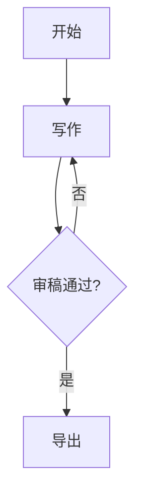

# 文章编辑态 + 历史版本 + Mermaid 配图 Implementation Plan

> **For agentic workers:** REQUIRED SUB-SKILL: Use superpowers:subagent-driven-development (recommended) or superpowers:executing-plans to implement this plan task-by-task. Steps use checkbox (`- [ ]`) syntax for tracking.

**Goal:** 为 vibe-writer 结果页新增左右分栏编辑态、全文历史快照、以及 WriterAgent 自主 Mermaid 配图能力。

**Architecture:** 后端新增 `article_versions` 表和对应 CRUD 路由；`WriterAgent` 工具列表新增 `generate_diagram` 工具；前端 `ArticlePage` 扩展编辑态（左右分栏）并新增历史版本侧边栏。

**Tech Stack:** Python/FastAPI/SQLAlchemy (aiosqlite)、React/TypeScript、react-markdown、mermaid.js

---

## 文件结构

| 文件 | 操作 | 说明 |
|------|------|------|
| `backend/models_db.py` | 修改 | 新增 `ArticleVersion` ORM 模型 |
| `backend/database.py` | 修改 | `init_db` 中 import ArticleVersion 触发建表 |
| `backend/routers/articles.py` | 修改 | 新增 PATCH、GET versions、restore 路由 |
| `backend/agent/writer.py` | 修改 | WRITER_TOOLS 新增 `generate_diagram`，tool_handlers 新增分支 |
| `backend/agent/prompts.py` | 修改 | CHAPTER_SYSTEM 新增配图工具使用说明 |
| `frontend/src/api.ts` | 修改 | 新增 patchArticle、getVersions、getVersion、restoreVersion |
| `frontend/src/pages/ArticlePage.tsx` | 修改 | 新增编辑态切换、左右分栏布局、历史侧边栏 |
| `tests/test_articles.py` | 修改/新增 | 新增版本相关路由的测试 |

---

## Task 1: 后端 — ArticleVersion 模型 + 建表

**Files:**
- Modify: `backend/models_db.py`
- Modify: `backend/database.py`
- Test: `tests/test_articles.py`

- [ ] **Step 1: 写失败测试**

在 `tests/test_articles.py` 末尾追加（如果文件不存在则新建）：

```python
# tests/test_articles.py  （在现有 import 和 fixture 之后追加）
import pytest
from httpx import AsyncClient, ASGITransport
from backend.main import app

@pytest.mark.asyncio
async def test_article_versions_table_exists():
    """PATCH 保存后能查到版本列表"""
    async with AsyncClient(transport=ASGITransport(app=app), base_url="http://test") as client:
        # 先创建一篇文章（直接写库）
        from backend.database import AsyncSessionLocal
        from backend.models_db import Article
        async with AsyncSessionLocal() as session:
            article = Article(job_id="test-job-v1", topic="test", content="initial", word_count=7)
            session.add(article)
            await session.commit()
            await session.refresh(article)
            article_id = article.id

        # PATCH 更新内容
        resp = await client.patch(f"/articles/{article_id}", json={"content": "updated content"})
        assert resp.status_code == 200

        # 查版本列表
        resp = await client.get(f"/articles/{article_id}/versions")
        assert resp.status_code == 200
        versions = resp.json()["versions"]
        assert len(versions) >= 1
        assert "saved_at" in versions[0]
        assert "word_count" in versions[0]
```

- [ ] **Step 2: 运行测试，确认失败**

```bash
cd /Users/0xelemen/myself/practice/vibe-writer
python -m pytest tests/test_articles.py::test_article_versions_table_exists -v
```

预期：FAIL（`ArticleVersion` 不存在 或 路由 404）

- [ ] **Step 3: 在 models_db.py 末尾新增 ArticleVersion**

```python
# backend/models_db.py — 在 Article 类之后追加

from sqlalchemy import ForeignKey

class ArticleVersion(Base):
    __tablename__ = "article_versions"

    id: Mapped[int] = mapped_column(Integer, primary_key=True, autoincrement=True)
    article_id: Mapped[str] = mapped_column(String, ForeignKey("articles.id"), nullable=False)
    content: Mapped[str] = mapped_column(Text, nullable=False)
    word_count: Mapped[int] = mapped_column(Integer, nullable=False, default=0)
    saved_at: Mapped[datetime] = mapped_column(
        DateTime(timezone=True),
        nullable=False,
        default=lambda: datetime.now(timezone.utc),
    )
```

- [ ] **Step 4: 在 database.py 的 init_db 中 import ArticleVersion**

找到 `backend/database.py` 第 18 行：
```python
    from backend.models_db import Article  # noqa: F401 — 触发 Base 注册
```
替换为：
```python
    from backend.models_db import Article, ArticleVersion  # noqa: F401 — 触发 Base 注册
```

- [ ] **Step 5: 运行测试，确认仍然失败（路由还没加）**

```bash
python -m pytest tests/test_articles.py::test_article_versions_table_exists -v
```

预期：FAIL with 404（表已建，但路由不存在）

- [ ] **Step 6: Commit**

```bash
git add backend/models_db.py backend/database.py tests/test_articles.py
git commit -m "feat: add ArticleVersion model"
```

---

## Task 2: 后端 — 版本相关路由（PATCH + GET versions + restore）

**Files:**
- Modify: `backend/routers/articles.py`
- Test: `tests/test_articles.py`

- [ ] **Step 1: 在 articles.py 中新增三个路由**

在 `backend/routers/articles.py` 的 `get_article` 函数之后追加：

```python
from datetime import datetime, timezone
from backend.models_db import Article, ArticleVersion
from backend.models import ArticlePatchRequest  # 下一步新增

@router.patch("/{article_id}")
async def patch_article(article_id: str, req: ArticlePatchRequest):
    """更新文章内容，同时追加一条历史快照"""
    async with AsyncSessionLocal() as session:
        article = await session.get(Article, article_id)
        if not article:
            raise HTTPException(status_code=404, detail="Article not found")
        article.content = req.content
        article.word_count = len(req.content.replace(" ", ""))
        version = ArticleVersion(
            article_id=article_id,
            content=req.content,
            word_count=article.word_count,
        )
        session.add(version)
        await session.commit()
    return {"status": "ok"}


@router.get("/{article_id}/versions")
async def list_versions(article_id: str):
    """返回该文章所有历史快照（不含全文），按时间降序"""
    async with AsyncSessionLocal() as session:
        article = await session.get(Article, article_id)
        if not article:
            raise HTTPException(status_code=404, detail="Article not found")
        result = await session.execute(
            select(ArticleVersion)
            .where(ArticleVersion.article_id == article_id)
            .order_by(ArticleVersion.saved_at.desc())
        )
        versions = result.scalars().all()
    return {
        "versions": [
            {"id": v.id, "saved_at": v.saved_at.isoformat(), "word_count": v.word_count}
            for v in versions
        ]
    }


@router.get("/{article_id}/versions/{version_id}")
async def get_version(article_id: str, version_id: int):
    """返回某条历史快照的完整内容"""
    async with AsyncSessionLocal() as session:
        version = await session.get(ArticleVersion, version_id)
        if not version or version.article_id != article_id:
            raise HTTPException(status_code=404, detail="Version not found")
    return {"id": version.id, "content": version.content, "saved_at": version.saved_at.isoformat()}


@router.post("/{article_id}/versions/{version_id}/restore")
async def restore_version(article_id: str, version_id: int):
    """将某条历史恢复为当前版本（等同于一次 PATCH）"""
    async with AsyncSessionLocal() as session:
        version = await session.get(ArticleVersion, version_id)
        if not version or version.article_id != article_id:
            raise HTTPException(status_code=404, detail="Version not found")
        article = await session.get(Article, article_id)
        if not article:
            raise HTTPException(status_code=404, detail="Article not found")
        article.content = version.content
        article.word_count = version.word_count
        new_version = ArticleVersion(
            article_id=article_id,
            content=version.content,
            word_count=version.word_count,
        )
        session.add(new_version)
        await session.commit()
    return {"status": "ok"}
```

- [ ] **Step 2: 在 models.py 中新增 ArticlePatchRequest**

在 `backend/models.py` 末尾追加：

```python
class ArticlePatchRequest(BaseModel):
    content: str
```

（`BaseModel` 已在文件顶部 import，无需重复）

- [ ] **Step 3: 修复 articles.py 顶部 import**

在 `backend/routers/articles.py` 顶部，将现有 import 替换为：

```python
from fastapi import APIRouter, HTTPException
from sqlalchemy import select
from backend.database import AsyncSessionLocal
from backend.models_db import Article, ArticleVersion
from backend.models import ArticlePatchRequest
```

- [ ] **Step 4: 运行测试，确认通过**

```bash
python -m pytest tests/test_articles.py::test_article_versions_table_exists -v
```

预期：PASS

- [ ] **Step 5: 补充 restore 路由测试**

在 `tests/test_articles.py` 追加：

```python
@pytest.mark.asyncio
async def test_restore_version():
    """restore 后当前文章内容变成历史版本的内容"""
    async with AsyncClient(transport=ASGITransport(app=app), base_url="http://test") as client:
        from backend.database import AsyncSessionLocal
        from backend.models_db import Article
        async with AsyncSessionLocal() as session:
            article = Article(job_id="test-job-restore", topic="test", content="v1 content", word_count=10)
            session.add(article)
            await session.commit()
            await session.refresh(article)
            article_id = article.id

        # 保存 v2
        await client.patch(f"/articles/{article_id}", json={"content": "v2 content"})

        # 获取版本列表，拿到最早那条（v2 保存的）
        resp = await client.get(f"/articles/{article_id}/versions")
        versions = resp.json()["versions"]
        version_id = versions[0]["id"]  # 最新的一条

        # 恢复
        resp = await client.post(f"/articles/{article_id}/versions/{version_id}/restore")
        assert resp.status_code == 200

        # 当前内容应该等于 v2
        resp = await client.get(f"/articles/{article_id}")
        assert resp.json()["content"] == "v2 content"
```

- [ ] **Step 6: 运行所有 articles 测试**

```bash
python -m pytest tests/test_articles.py -v
```

预期：全部 PASS

- [ ] **Step 7: Commit**

```bash
git add backend/routers/articles.py backend/models.py
git commit -m "feat: add article version routes (PATCH, list, restore)"
```

---

## Task 3: 后端 — WriterAgent 新增 generate_diagram 工具

**Files:**
- Modify: `backend/agent/writer.py`
- Modify: `backend/agent/prompts.py`

> 这个 task 没有自动化测试（LLM 行为难以 mock），用手动验证代替。

- [ ] **Step 1: 在 writer.py 的 WRITER_TOOLS 列表中追加工具定义**

在 `backend/agent/writer.py` 第 27 行（`]` 闭合括号）前追加：

```python
    ,
    {
        "name": "generate_diagram",
        "description": (
            "为当前章节生成一张 Mermaid 图表。"
            "当章节涉及流程、架构、状态机、时序等结构性内容时调用。"
            "纯概念性或叙述性章节不需要配图。"
        ),
        "input_schema": {
            "type": "object",
            "required": ["diagram_type", "mermaid_code"],
            "properties": {
                "diagram_type": {
                    "type": "string",
                    "enum": ["flowchart", "sequenceDiagram", "stateDiagram", "graph"],
                    "description": "图表类型",
                },
                "mermaid_code": {
                    "type": "string",
                    "description": "完整的 Mermaid 代码，不含 ```mermaid 包裹",
                },
            },
        },
    }
```

- [ ] **Step 2: 在 write() 和 write_stream() 的 tool_handlers 中新增 generate_diagram 分支**

在 `backend/agent/writer.py` 中，找到 `write` 方法里的 `tool_handlers` 参数：

```python
                tool_handlers={"search": lambda query: self._search_fn(query)},
```

替换为：

```python
                tool_handlers={
                    "search": lambda query: self._search_fn(query),
                    "generate_diagram": self._handle_diagram,
                },
```

同理修改 `write_stream` 方法中相同的 `tool_handlers` 参数。

- [ ] **Step 3: 在 WriterAgent 类中新增 _handle_diagram 方法**

在 `WriterAgent` 类的 `write` 方法之前插入：

```python
    async def _handle_diagram(self, diagram_type: str, mermaid_code: str) -> str:
        """将 LLM 生成的 Mermaid 代码包装成 fenced code block 返回给 LLM"""
        return f"```mermaid\n{mermaid_code}\n```\n\n（图表已生成，请将以上代码块插入章节正文的合适位置）"
```

- [ ] **Step 4: 在 prompts.py 的 CHAPTER_SYSTEM 中说明配图工具**

在 `backend/agent/prompts.py` 中，找到 `CHAPTER_SYSTEM` 字符串，在末尾（`"""` 之前）追加：

```
\n\n如果章节内容涉及流程、架构或状态机，可以调用 generate_diagram 工具生成一张 Mermaid 图表，并将返回的代码块插入正文。纯概念或叙述性内容不需要配图。"""
```

即将原来的：
```python
CHAPTER_SYSTEM = """你是一位有独立见解的专栏作者。...
只输出章节正文，不要重复章节标题。"""
```
改为：
```python
CHAPTER_SYSTEM = """你是一位有独立见解的专栏作者。...
只输出章节正文，不要重复章节标题。

如果章节内容涉及流程、架构或状态机，可以调用 generate_diagram 工具生成一张 Mermaid 图表，并将返回的代码块插入正文。纯概念或叙述性内容不需要配图。"""
```

- [ ] **Step 5: 运行现有测试确认没有回归**

```bash
python -m pytest -v
```

预期：全部 PASS（writer 没有自动化测试，跑全套确认其他测试不受影响）

- [ ] **Step 6: Commit**

```bash
git add backend/agent/writer.py backend/agent/prompts.py
git commit -m "feat: add generate_diagram tool to WriterAgent"
```

---

## Task 4: 前端 — api.ts 新增版本相关接口

**Files:**
- Modify: `frontend/src/api.ts`

- [ ] **Step 1: 在 api.ts 末尾追加类型和函数**

```typescript
// frontend/src/api.ts — 在现有代码末尾追加

export interface ArticleVersionSummary {
  id: number
  saved_at: string
  word_count: number
}

export interface ArticleVersionDetail {
  id: number
  content: string
  saved_at: string
}

export async function patchArticle(id: string, content: string): Promise<void> {
  const res = await fetch(`${API_BASE}/articles/${id}`, {
    method: 'PATCH',
    headers: { 'Content-Type': 'application/json' },
    body: JSON.stringify({ content }),
  })
  if (!res.ok) throw new Error('Failed to save article')
}

export async function getVersions(id: string): Promise<ArticleVersionSummary[]> {
  const res = await fetch(`${API_BASE}/articles/${id}/versions`)
  if (!res.ok) throw new Error('Failed to fetch versions')
  const data = await res.json()
  return data.versions
}

export async function getVersion(articleId: string, versionId: number): Promise<ArticleVersionDetail> {
  const res = await fetch(`${API_BASE}/articles/${articleId}/versions/${versionId}`)
  if (!res.ok) throw new Error('Failed to fetch version')
  return res.json()
}

export async function restoreVersion(articleId: string, versionId: number): Promise<void> {
  const res = await fetch(`${API_BASE}/articles/${articleId}/versions/${versionId}/restore`, {
    method: 'POST',
  })
  if (!res.ok) throw new Error('Failed to restore version')
}
```

- [ ] **Step 2: 确认 TypeScript 编译无报错**

```bash
cd /Users/0xelemen/myself/practice/vibe-writer/frontend
npx tsc --noEmit
```

预期：无错误输出

- [ ] **Step 3: Commit**

```bash
git add frontend/src/api.ts
git commit -m "feat: add article version API functions"
```

---

## Task 5: 前端 — ArticlePage 编辑态（左右分栏）

**Files:**
- Modify: `frontend/src/pages/ArticlePage.tsx`

- [ ] **Step 1: 在 ArticlePage.tsx 顶部新增 import**

在文件第 1 行的 import 块中，将现有 import 替换为：

```typescript
import { useEffect, useState, useCallback } from 'react'
import { useParams, useNavigate } from 'react-router-dom'
import ReactMarkdown from 'react-markdown'
import remarkGfm from 'remark-gfm'
import { getArticle, patchArticle } from '../api'
import type { ArticleDetail } from '../api'
```

- [ ] **Step 2: 在 ArticlePage 组件内新增编辑态 state**

在 `const [activeSlug, setActiveSlug] = useState('')` 之后追加：

```typescript
  const [isEditing, setIsEditing] = useState(false)
  const [editContent, setEditContent] = useState('')
  const [saving, setSaving] = useState(false)
```

- [ ] **Step 3: 新增 handleEdit / handleSave / handleCancel 函数**

在 `handleDownload` 函数之后追加：

```typescript
  function handleEdit() {
    if (!article) return
    setEditContent(article.content)
    setIsEditing(true)
  }

  async function handleSave() {
    if (!article || !id) return
    setSaving(true)
    try {
      await patchArticle(id, editContent)
      setArticle({ ...article, content: editContent })
      setIsEditing(false)
    } finally {
      setSaving(false)
    }
  }

  function handleCancel() {
    setIsEditing(false)
    setEditContent('')
  }
```

- [ ] **Step 4: 在 Toolbar 中替换「下载」按钮区域**

找到现有 Toolbar 中的下载按钮：

```typescript
        <button
          className="btn-primary"
          onClick={handleDownload}
          style={{ flexShrink: 0, fontSize: '12px', padding: '5px 14px' }}
        >
          ↓ 下载
        </button>
```

替换为：

```typescript
        {isEditing ? (
          <>
            <button
              className="btn-primary"
              onClick={handleSave}
              disabled={saving}
              style={{ flexShrink: 0, fontSize: '12px', padding: '5px 14px' }}
            >
              {saving ? '保存中…' : '✓ 保存'}
            </button>
            <button
              onClick={handleCancel}
              style={{
                flexShrink: 0, fontSize: '12px', padding: '5px 14px',
                background: 'none', border: '1px solid var(--border)',
                borderRadius: '4px', cursor: 'pointer', color: 'var(--text-muted)',
              }}
            >
              ✕ 取消
            </button>
          </>
        ) : (
          <>
            <button
              onClick={handleEdit}
              style={{
                flexShrink: 0, fontSize: '12px', padding: '5px 14px',
                background: 'none', border: '1px solid var(--border)',
                borderRadius: '4px', cursor: 'pointer', color: 'var(--text)',
              }}
            >
              ✎ 编辑
            </button>
            <button
              className="btn-primary"
              onClick={handleDownload}
              style={{ flexShrink: 0, fontSize: '12px', padding: '5px 14px' }}
            >
              ↓ 下载
            </button>
          </>
        )}
```

- [ ] **Step 5: 在主体区域新增编辑态分栏视图**

找到 `{/* 正文 */}` 注释下方的 `<main>` 标签，将整个 `<main>` 内容替换为：

```typescript
        <main style={{ padding: '48px 0 100px', minWidth: 0 }}>
          {isEditing ? (
            /* 编辑态：左右分栏 */
            <div style={{ display: 'grid', gridTemplateColumns: '1fr 1fr', gap: '24px', height: 'calc(100vh - 120px)' }}>
              {/* 左栏：预览 */}
              <div style={{
                overflowY: 'auto',
                paddingRight: '16px',
                borderRight: '1px solid var(--border)',
              }}>
                <p style={{ fontSize: '11px', color: 'var(--text-muted)', marginBottom: '16px', fontWeight: 600, letterSpacing: '1px', textTransform: 'uppercase' }}>预览</p>
                <div className="prose">
                  <ReactMarkdown remarkPlugins={[remarkGfm]}>
                    {editContent}
                  </ReactMarkdown>
                </div>
              </div>
              {/* 右栏：编辑 */}
              <div style={{ display: 'flex', flexDirection: 'column' }}>
                <p style={{ fontSize: '11px', color: 'var(--accent)', marginBottom: '16px', fontWeight: 600, letterSpacing: '1px', textTransform: 'uppercase' }}>编辑 Markdown</p>
                <textarea
                  value={editContent}
                  onChange={(e) => setEditContent(e.target.value)}
                  style={{
                    flex: 1,
                    border: '1.5px solid var(--accent)',
                    borderRadius: '6px',
                    padding: '16px',
                    fontSize: '13px',
                    fontFamily: 'monospace',
                    lineHeight: '1.7',
                    color: 'var(--text)',
                    background: 'var(--bg)',
                    resize: 'none',
                    outline: 'none',
                  }}
                />
              </div>
            </div>
          ) : (
            /* 阅读态：原有渲染 */
            <div className="prose">
              <ReactMarkdown
                remarkPlugins={[remarkGfm]}
                components={{
                  h1: ({ children }) => <h1 id={slugify(String(children))}>{children}</h1>,
                  h2: ({ children }) => <h2 id={slugify(String(children))}>{children}</h2>,
                  h3: ({ children }) => <h3 id={slugify(String(children))}>{children}</h3>,
                }}
              >
                {article.content}
              </ReactMarkdown>
            </div>
          )}
        </main>
```

- [ ] **Step 6: 确认 TypeScript 编译无报错**

```bash
cd /Users/0xelemen/myself/practice/vibe-writer/frontend
npx tsc --noEmit
```

预期：无错误

- [ ] **Step 7: 手动验证**

```bash
# 后端
cd /Users/0xelemen/myself/practice/vibe-writer
python -m uvicorn backend.main:app --reload

# 前端（另一个终端）
cd frontend && npm run dev
```

打开 `http://localhost:5173`，进入任意文章，点「✎ 编辑」，确认：
- Toolbar 切换为「✓ 保存」「✕ 取消」
- 主体区域变为左右分栏
- 右栏输入时左栏实时更新
- 点「✓ 保存」后退出编辑态，内容更新

- [ ] **Step 8: Commit**

```bash
git add frontend/src/pages/ArticlePage.tsx
git commit -m "feat: add split-pane edit mode to ArticlePage"
```

---

## Task 6: 前端 — 历史版本侧边栏

**Files:**
- Modify: `frontend/src/pages/ArticlePage.tsx`

- [ ] **Step 1: 新增 import**

在 `frontend/src/pages/ArticlePage.tsx` 顶部 import 中，追加版本相关函数：

```typescript
import { getArticle, patchArticle, getVersions, getVersion, restoreVersion } from '../api'
import type { ArticleDetail, ArticleVersionSummary } from '../api'
```

- [ ] **Step 2: 新增历史版本 state**

在 `const [saving, setSaving] = useState(false)` 之后追加：

```typescript
  const [showHistory, setShowHistory] = useState(false)
  const [versions, setVersions] = useState<ArticleVersionSummary[]>([])
  const [previewContent, setPreviewContent] = useState<string | null>(null)
  const [previewVersionId, setPreviewVersionId] = useState<number | null>(null)
```

- [ ] **Step 3: 新增 handleShowHistory / handlePreviewVersion / handleRestoreVersion 函数**

在 `handleCancel` 函数之后追加：

```typescript
  async function handleShowHistory() {
    if (!id) return
    const list = await getVersions(id)
    setVersions(list)
    setPreviewContent(null)
    setPreviewVersionId(null)
    setShowHistory(true)
  }

  async function handlePreviewVersion(versionId: number) {
    if (!id) return
    const v = await getVersion(id, versionId)
    setPreviewContent(v.content)
    setPreviewVersionId(versionId)
  }

  async function handleRestoreVersion() {
    if (!id || previewVersionId === null || !article) return
    await restoreVersion(id, previewVersionId)
    setArticle({ ...article, content: previewContent! })
    setShowHistory(false)
    setPreviewContent(null)
    setPreviewVersionId(null)
  }
```

- [ ] **Step 4: 在 Toolbar 的「✎ 编辑」按钮前新增「历史」按钮**

在非编辑态的按钮组（`<>` 内）的第一个按钮前插入：

```typescript
            <button
              onClick={handleShowHistory}
              style={{
                flexShrink: 0, fontSize: '12px', padding: '5px 14px',
                background: 'none', border: '1px solid var(--border)',
                borderRadius: '4px', cursor: 'pointer', color: 'var(--text-muted)',
              }}
            >
              历史
            </button>
```

- [ ] **Step 5: 在组件 return 最外层 div 的末尾新增历史侧边栏**

在 `</div>` 最后的闭合标签之前（整个组件 return 的最后）插入：

```typescript
      {/* 历史版本侧边栏 */}
      {showHistory && (
        <div style={{
          position: 'fixed', top: 0, right: 0, bottom: 0, width: '360px',
          background: 'var(--bg)', borderLeft: '1px solid var(--border)',
          zIndex: 30, display: 'flex', flexDirection: 'column',
          boxShadow: '-4px 0 16px rgba(0,0,0,0.08)',
        }}>
          {/* 侧边栏 header */}
          <div style={{
            padding: '16px 20px', borderBottom: '1px solid var(--border)',
            display: 'flex', alignItems: 'center', justifyContent: 'space-between',
          }}>
            <span style={{ fontWeight: 600, fontSize: '14px' }}>历史版本</span>
            <button
              onClick={() => setShowHistory(false)}
              style={{ background: 'none', border: 'none', cursor: 'pointer', fontSize: '16px', color: 'var(--text-muted)' }}
            >
              ✕
            </button>
          </div>

          {/* 版本列表 */}
          <div style={{ flex: 1, overflowY: 'auto', padding: '8px 0' }}>
            {versions.map((v) => (
              <div
                key={v.id}
                onClick={() => handlePreviewVersion(v.id)}
                style={{
                  padding: '12px 20px', cursor: 'pointer',
                  background: previewVersionId === v.id ? 'var(--surface)' : 'transparent',
                  borderLeft: previewVersionId === v.id ? '3px solid var(--accent)' : '3px solid transparent',
                  transition: 'background 0.15s',
                }}
              >
                <div style={{ fontSize: '13px', color: 'var(--text)' }}>
                  {new Date(v.saved_at).toLocaleString('zh-CN', { month: 'short', day: 'numeric', hour: '2-digit', minute: '2-digit' })}
                </div>
                <div style={{ fontSize: '12px', color: 'var(--text-muted)', marginTop: '2px' }}>
                  {v.word_count.toLocaleString()} 字
                </div>
              </div>
            ))}
          </div>

          {/* 预览区 */}
          {previewContent !== null && (
            <div style={{ borderTop: '1px solid var(--border)', padding: '16px 20px', maxHeight: '40vh', overflowY: 'auto' }}>
              <div style={{ display: 'flex', justifyContent: 'space-between', alignItems: 'center', marginBottom: '12px' }}>
                <span style={{ fontSize: '12px', color: 'var(--text-muted)', fontWeight: 600 }}>预览</span>
                <button
                  className="btn-primary"
                  onClick={handleRestoreVersion}
                  style={{ fontSize: '12px', padding: '4px 12px' }}
                >
                  恢复此版本
                </button>
              </div>
              <div className="prose" style={{ fontSize: '12px' }}>
                <ReactMarkdown remarkPlugins={[remarkGfm]}>{previewContent}</ReactMarkdown>
              </div>
            </div>
          )}
        </div>
      )}
```

- [ ] **Step 6: 确认 TypeScript 编译无报错**

```bash
cd /Users/0xelemen/myself/practice/vibe-writer/frontend
npx tsc --noEmit
```

- [ ] **Step 7: 手动验证**

1. 编辑文章并保存 2-3 次（每次改动一点内容）
2. 点「历史」按钮，确认侧边栏出现并列出版本列表
3. 点某个版本，确认底部预览区出现内容
4. 点「恢复此版本」，确认文章内容回到该版本，侧边栏关闭

- [ ] **Step 8: Commit**

```bash
git add frontend/src/pages/ArticlePage.tsx
git commit -m "feat: add version history sidebar to ArticlePage"
```

---

## Task 7: 前端 — Mermaid 渲染

**Files:**
- Modify: `frontend/src/pages/ArticlePage.tsx`
- Modify: `frontend/package.json`（通过 npm install）

- [ ] **Step 1: 安装 mermaid**

```bash
cd /Users/0xelemen/myself/practice/vibe-writer/frontend
npm install mermaid
```

- [ ] **Step 2: 安装 rehype-mermaid 或使用自定义 component**

`react-markdown` 不直接支持 mermaid，需要自定义 `code` 组件：

在 `ArticlePage.tsx` 顶部追加 import：

```typescript
import mermaid from 'mermaid'
```

在组件内（`useEffect` 之后）追加初始化：

```typescript
  useEffect(() => {
    mermaid.initialize({ startOnLoad: false, theme: 'neutral' })
  }, [])
```

- [ ] **Step 3: 新增 MermaidBlock 组件（在 ArticlePage.tsx 文件顶层，组件函数之外）**

在 `slugify` 函数之后、`ArticlePage` 函数之前插入：

```typescript
function MermaidBlock({ code }: { code: string }) {
  const ref = useRef<HTMLDivElement>(null)
  const idRef = useRef(`mermaid-${Math.random().toString(36).slice(2)}`)

  useEffect(() => {
    if (!ref.current) return
    mermaid.render(idRef.current, code).then(({ svg }) => {
      if (ref.current) ref.current.innerHTML = svg
    }).catch(() => {
      if (ref.current) ref.current.textContent = code
    })
  }, [code])

  return <div ref={ref} style={{ margin: '16px 0' }} />
}
```

同时在文件顶部 import 中补充 `useRef`：

```typescript
import { useEffect, useState, useCallback, useRef } from 'react'
```

- [ ] **Step 4: 在两处 ReactMarkdown 中注册 code 组件**

阅读态的 `<ReactMarkdown>` 已有 `components` prop，追加 `code` 处理：

```typescript
              components={{
                h1: ({ children }) => <h1 id={slugify(String(children))}>{children}</h1>,
                h2: ({ children }) => <h2 id={slugify(String(children))}>{children}</h2>,
                h3: ({ children }) => <h3 id={slugify(String(children))}>{children}</h3>,
                code: ({ className, children }) => {
                  const lang = /language-(\w+)/.exec(className || '')?.[1]
                  if (lang === 'mermaid') return <MermaidBlock code={String(children).trim()} />
                  return <code className={className}>{children}</code>
                },
              }}
```

编辑态左栏的 `<ReactMarkdown>` 同样追加相同的 `code` 组件（复制粘贴同一段 components prop）。

- [ ] **Step 5: 确认 TypeScript 编译无报错**

```bash
cd /Users/0xelemen/myself/practice/vibe-writer/frontend
npx tsc --noEmit
```

- [ ] **Step 6: 手动验证**

在文章编辑态右栏手动输入：

````

````

确认左栏预览中出现渲染后的流程图（而非原始代码）。

- [ ] **Step 7: Commit**

```bash
git add frontend/src/pages/ArticlePage.tsx frontend/package.json frontend/package-lock.json
git commit -m "feat: render Mermaid diagrams in article view and edit preview"
```

---

## 自检

**Spec coverage:**
- [x] 编辑态入口/出口（Toolbar 按钮切换）→ Task 5
- [x] 左右分栏布局 → Task 5
- [x] 手动保存 → Task 5 handleSave
- [x] article_versions 表 → Task 1
- [x] PATCH / GET versions / GET version / POST restore → Task 2
- [x] 历史版本侧边栏（列表 + 预览 + 恢复）→ Task 6
- [x] generate_diagram tool → Task 3
- [x] Mermaid 前端渲染 → Task 7

**Placeholder scan:** 无 TBD / TODO

**Type consistency:**
- `ArticleVersionSummary.id: number` — Task 4 定义，Task 6 使用 ✓
- `patchArticle(id, content)` — Task 4 定义，Task 5 使用 ✓
- `getVersions / getVersion / restoreVersion` — Task 4 定义，Task 6 使用 ✓
- `ArticlePatchRequest` — Task 2 定义，articles.py 使用 ✓
